# Personaje2024
## Nombre del personaje
Niño Cadaver (Extraño mundo de Jack)
## Creador
Isaac Cano Hernández
## Explicacion del funcionamiento
El personaje funcionara a traves de un ESP32, el cual le dara las intrucciones a los demas elementos (Led, Servo, Ultrasonic, Buzzer(Aun no seguro)), este cobrara vida cundo el ultrasonico detecte a un objeto o individuo en una determinada distancia, las luces dara un estilo de vida el cual simularan los ojos, los servos daran movilidad a ambos brazos y piernas y el Buzzer, (Aun por ver si lo implementaremos), emitira algun sonido relacionado con el personaje o la navidad.

## Materiales a utlizar
|Material|Imagen|Cantidad|Costo|
|--|--|--|--|
|ESP32|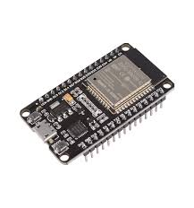|1|120.00|
|Cable de puente|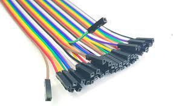|1|120.00|
|Led|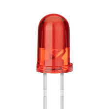|1|120.00|
|Resistencia|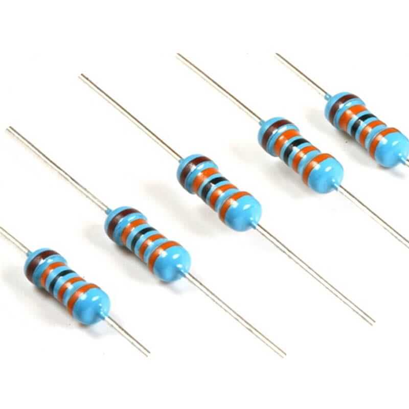|1|120.00|
|Ultrasonico|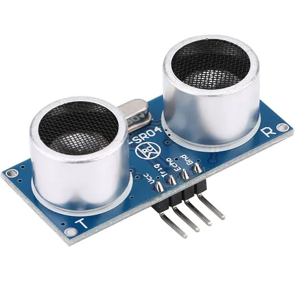|1|120.00|
|Servo Motor|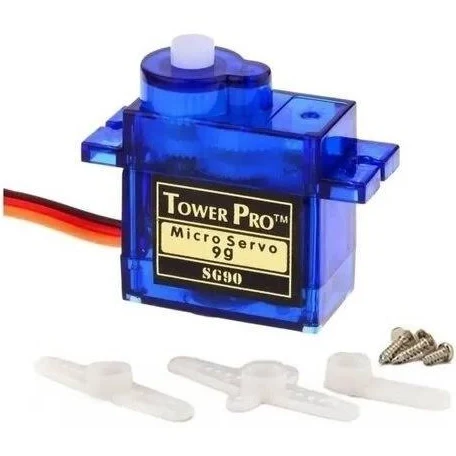|1|120.00|
|Buzzer|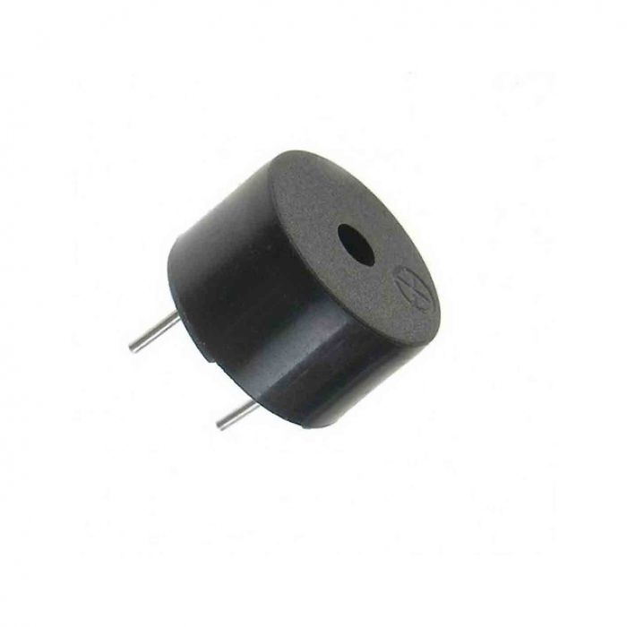|1|120.00|
|Muñeco Base||1|120.00|
|Telas||1|120.00|
|Hilo y Aguja||1|120.00|
|Pintura en lata||1|120.00|
|Plumon|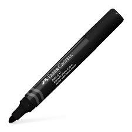|1|120.00|
|Plumon|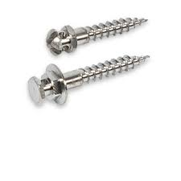|1|120.00|

## Software a utilizar
|Software|Versión|
|--|--|
|Thonny|4.1.6|
|Arduino IDE|2.3.2|
|Fritzing|...|
|Node-RED|...|
|TinkerCAD|...|

## Dibujo del personaje
Imagen hecha a mano o con software

## Enlaces de la simulación de wokwi
Casa Inteligente: https://wokwi.com/projects/409654806594213889
Simulacion MuñecoNavideño: https://wokwi.com/projects/409916129240812545

## Videos
Drive Video: https://drive.google.com/drive/folders/15Lg08ZRPHb3ntOmPAtM2NnKsxome0ra2?usp=sharing

## Capturas de Evaluaciones de Curso de C
|Modulo|Imagen Resultado|
|--|--|
|Modulo 1|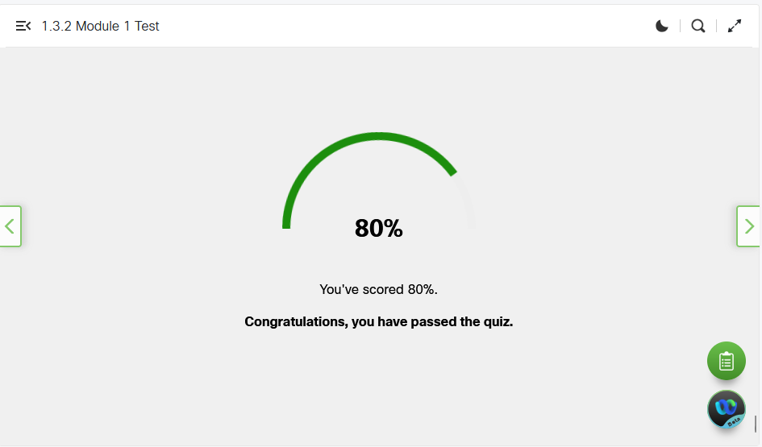|
|Modulo 2|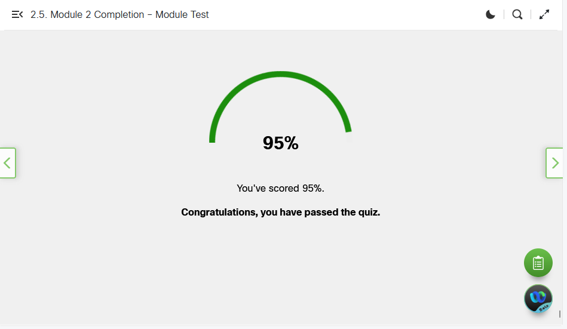|
|Modulo 3|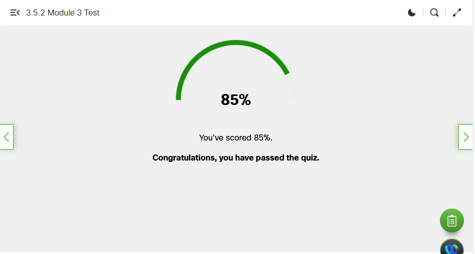|
|Modulo 4|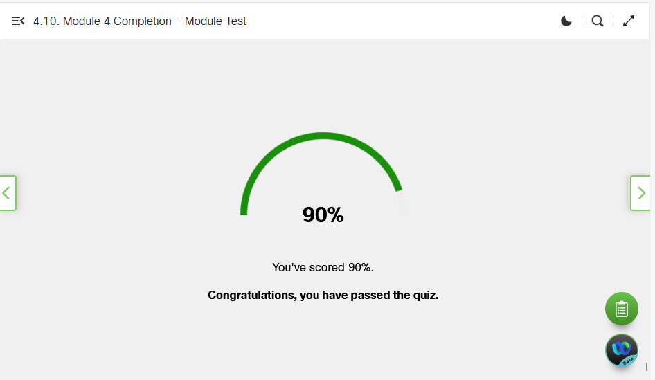|
|Modulo 5|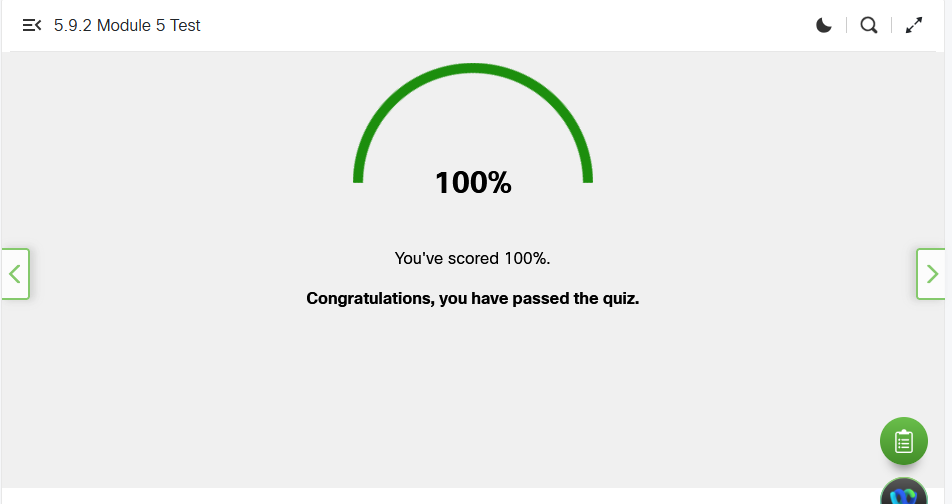|
|Modulo Final|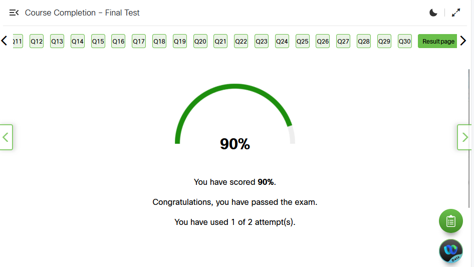|
|...||

